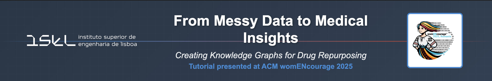

This repository supports the tutorial presented at [womENcourage 2025](https://womencourage.acm.org/2025/), focused on biomedical data wrangling and the construction of knowledge graphs (KGs) for **drug repurposing**. 

Participants will learn practical techniques using Python, public drug databases, and the Neo4j graph database — all within Google Colab.

---

## 📚 Tutorial Overview

- **Objective**: Learn to extract, clean, integrate, and visualize pharmaceutical data as Knowledge Graphs.
- **Main Tooling**: Python, Neo4j, MedJsonify (custom methodology), Google Colab
- **Key Concepts**:
  - Named Entity Recognition (NER)
  - Relationship extraction
  - Biomedical ontologies and sources (DrugBank, DO, ChEBI, etc.)
  - Cypher queries and graph visualization

---

## 📁 Repository Structure
| Folder/File | Description |
|------------------|-------------|
| `notebooks/` | Step-by-step Colab notebooks |
| `data/` | Sample datasets (with metadata) |
| `scripts/` | Python scripts (e.g., MedJsonify utilities) |
| `docs/` | Tutorial webpage files (HTML, CSS, assets) |
| `requirements.txt` | Python dependencies |
| `.gitignore` | Files and folders excluded from versioning |
| `LICENSE` | License information |

---

## 🌐 Tutorial Website
Visit our tutorial webpage: [https://yourusername.github.io/repository-name](https://yourusername.github.io/repository-name)

The website source code is located in the `docs/` folder.

## ▶️ How to Run (Google Colab)

All notebooks are Colab-ready. Click the badge below to launch the main tutorial:

---

## 🔗 Data Sources

We use data from:
- [DailyMed](https://dailymed.nlm.nih.gov/)
- [DrugBank](https://go.drugbank.com/)
- [ChEBI](https://www.ebi.ac.uk/chebi/)
- [Orphanet](https://www.orpha.net/)
- [Purple Book](https://purplebooksearch.fda.gov/)
- [Orange Book](https://www.accessdata.fda.gov/scripts/cder/ob/)

See the `data/README.md` for usage and licensing info.

---

## 🤝 Acknowledgments
Supported by:
- [IBEB](https://ibeb.ciencias.ulisboa.pt/en/home-2/)  
- [LASIGE](https://lasige.pt)
- [NOVA LINCS](https://nova-lincs.di.fct.unl.pt)
- [womENcourage 2025](https://womencourage.acm.org/2025/)

---

## 📜 License

This project is licensed under the MIT License. See `LICENSE` for details.
